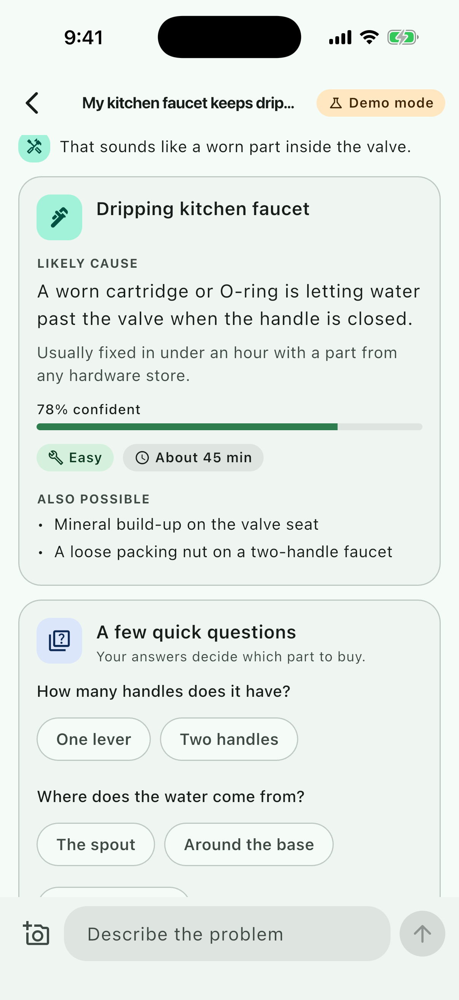
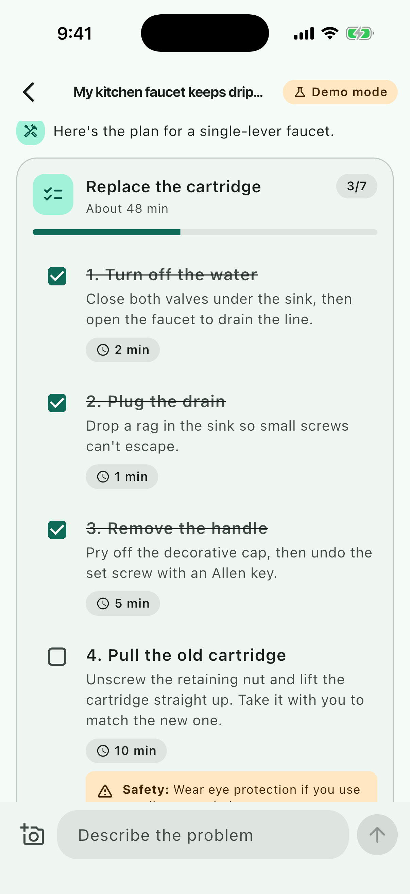
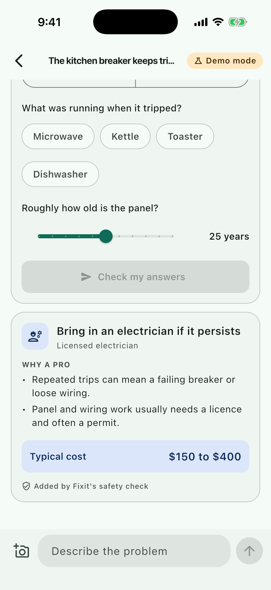
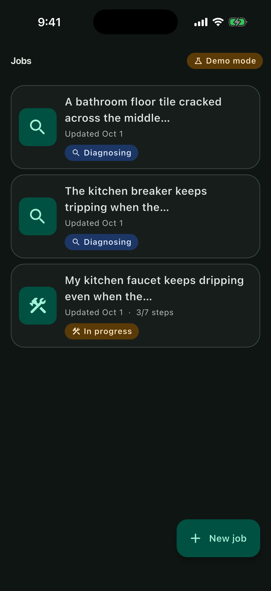
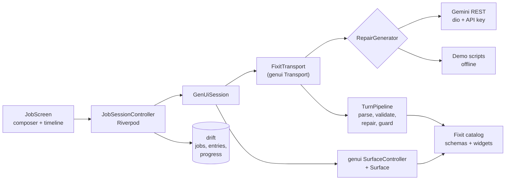

# Fixit

A Flutter home-repair assistant whose answers are interactive UI, not paragraphs. Describe the problem or snap a photo, and the model replies with generated widgets: a diagnosis, a few tap-to-answer questions, a checklist with safety callouts, a priced parts list, and a "call a pro" card when the job isn't DIY-safe.

[](https://github.com/OwaisMunawar/fixit-genui/actions/workflows/ci.yml)


[](LICENSE)

<p>
  
  
  
  
</p>

Unedited captures from the iOS 26.5 Simulator (iPhone 17 Pro) running demo mode. More in [docs/screenshots](docs/screenshots).

## Why

Ask a chatbot why your breaker keeps tripping and you get six paragraphs to scroll through while standing at the panel. The information is there, but you can't act on it: the questions it needs answered are buried in prose, the steps aren't something you can tick off, and the safety warning is sentence four of paragraph three.

Generated UI fixes the shape of the answer. The model still decides what to say, but it says it with components built for the job: questions you answer with a tap, a checklist that remembers where you got to, a parts list with a real total, and a safety banner that is always first. Because those components are typed and schema-checked, the app can also verify the answer before showing it, which is what makes the safety guarantees below possible.

## Features

- **A domain widget catalog.** Eight genui catalog items (DiagnosisCard, QuestionForm, StepChecklist, PartsList, ProCallout, SafetyBanner, NoteCard, ResponseStack), each with a JSON schema, a typed freezed model and a reusable view built from shared primitives.
- **Answers flow back.** QuestionForm supports single choice, multi choice, slider and yes/no. Submitting sends both raw values and readable "question, answer" lines to the model, and locks the form.
- **Validate, repair, never blank.** Every component is checked against its schema and a few rules a schema can't express. Invalid pieces degrade to a fallback note in place, keeping whatever text they had; the rest of the answer still renders.
- **Safety guardrail.** Electrical, gas and structural jobs always get a SafetyBanner first and a ProCallout, on every turn, whatever the model returned. Understated severities are upgraded, and injected content is labelled.
- **Photos.** Camera or library via `image_picker`, downscaled to 1024px JPEG off the UI isolate before it is stored or sent.
- **Jobs that remember.** Each conversation is a job saved with drift: history, generated surfaces, submitted answers and ticked steps. Reopening a job restores the UI exactly. Status (diagnosing, in progress, done) follows the latest checklist.
- **Demo mode.** With no API key, a scripted generator answers three sample problems through the same pipeline. Fully offline, zero setup.
- **Polish.** Material 3 light and dark themes, list-detail layout on tablets, semantics labels and live regions, tested at 2x text, strings in ARB.

## Architecture



Feature-first layout (`lib/features/<feature>/{data,domain,presentation}`), with everything genui-specific in `lib/genui` behind `GenUiSession` and `RepairGenerator`, so genui can be upgraded or replaced in one place. Decisions and the alternatives I rejected are in [docs/ARCHITECTURE.md](docs/ARCHITECTURE.md).

## Tech stack

| Concern | Choice |
| --- | --- |
| Framework | Flutter 3.44.2, Dart 3.12, Material 3 |
| Generative UI | [genui](https://pub.dev/packages/genui) 0.10.4 (A2UI v0.9), json_schema_builder |
| Model | Gemini `generateContent` over REST with [dio](https://pub.dev/packages/dio) |
| State and DI | flutter_riverpod 3 |
| Navigation | go_router 18 |
| Storage | drift 2.35 (SQLite) |
| Models | freezed, json_serializable |
| Photos | image_picker, image (downscaling) |
| Quality | very_good_analysis, flutter_test, goldens, integration_test |

## Quick start

Demo mode, no key or account needed:

```sh
git clone https://github.com/OwaisMunawar/fixit-genui.git && cd fixit-genui
flutter pub get
flutter run
```

Tap **New job** and pick a sample: leaky faucet, tripped breaker or cracked tile. The breaker sample shows the guardrail adding a pro callout the scripted "model" left out.

## Using Gemini

Get a key from [Google AI Studio](https://aistudio.google.com/apikey), then:

```sh
flutter run --dart-define=GEMINI_API_KEY=your-key
```

or copy `.env.example` to `.env` (git-ignored) and run `flutter run --dart-define-from-file=.env`. `GEMINI_MODEL` picks the model (default `gemini-2.5-flash`), and `FIXIT_DEMO=true` forces demo mode even with a key.

The key is sent in the `x-goog-api-key` header, never in a URL. A key compiled into an app can be extracted, so this setup is for development; for a release, put the model behind `firebase_ai` with App Check or your own backend. Only the `RepairGenerator` implementation changes (ADR 2).

## Quality

```sh
flutter analyze --fatal-infos                      # very_good_analysis, zero issues
flutter test --coverage --exclude-tags golden      # 171 unit and widget tests
dart run tool/coverage_gate.dart coverage/lcov.info 85
flutter test --tags golden                         # 20 goldens, light and dark
flutter test integration_test -d <simulator>       # demo happy path on a device
```

- Gated coverage on `lib/genui` and domain code is about 97%; CI fails below 85%.
- Unit tests cover the parser, assembler, validator, sanitizer, guardrail, hazard classifier, generators (Gemini against a fake HTTP adapter), transport, session restore and the drift repository against an in-memory database.
- A test feeds a schema-invalid answer through the real genui `SurfaceController` and checks the fallback card renders, its siblings survive, and genui itself reports no validation error.
- Every catalog widget has widget tests, a 2x text-scale overflow check, and goldens in both themes. Goldens use real Roboto and run on macOS only in CI, because glyph rendering differs across platforms.
- CI also checks formatting, that generated code is up to date, and builds for the iOS simulator and Android.

## Roadmap

- Stream the model's prose while the UI part is still being validated.
- `firebase_ai` generator with App Check for a production build.
- Mark up the user's photo (circle the leak) and send the annotation.
- A shopping list across jobs, grouped by store aisle.
- More languages; the strings are already in ARB.
- Spot-check guardrail coverage with an eval set of hazardous prompts.

---

Built by [Owais Munawwar](https://github.com/OwaisMunawar). I'm available for React Native, AI and iOS work on [Upwork](https://www.upwork.com/freelancers/owaism11).
