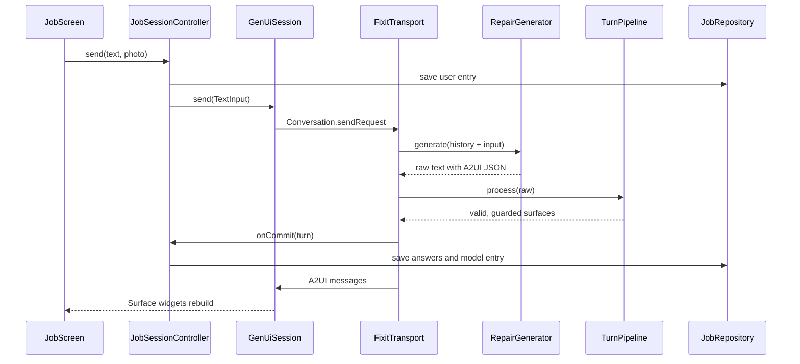

# Architecture

Fixit answers a repair question with generated UI. A model writes A2UI
messages that reference a small catalog of widgets; the app validates and
repairs them, enforces safety rules, renders them with
[genui](https://pub.dev/packages/genui), and saves everything so a job can be
reopened exactly as it was left.

## Layout

```
lib/
  core/          theme, routing, DI, errors, shared UI primitives
  genui/         everything that knows about genui and A2UI
    catalog/     typed models, views, catalog items, the catalog
    generator/   RepairGenerator interface, Gemini and demo implementations
    pipeline/    parse, assemble, validate, sanitize
    guardrails/  hazard classification and the safety post-check
    session/     GenUiSession, FixitTransport, ChatMessage codec
  features/
    jobs/        jobs list, job domain, drift storage
    assistant/   the job screen, composer, photos, session controller
```

`features/` never imports `genui` types except through `lib/genui/session`.
Catalog views take typed models and callbacks, not genui contexts, so they can
be tested and reused without a surface.

## Data flow for one turn



Form answers take the same path in reverse: the QuestionForm dispatches a
`submitAnswers` action, genui's `SurfaceController` turns it into a
`ChatMessage`, and `Conversation` hands it to the transport like any other
request.

## Decisions

### ADR 1. genui instead of a hand-rolled JSON-to-widget renderer

**Decision.** Use genui 0.10.4 for the protocol (A2UI v0.9), surface lifecycle,
data model and rendering, and keep the app-specific parts in our own layer.

**Why.** genui already solves the hard, boring parts: incremental message
parsing, component trees with ids, a reactive per-surface data model, and
turning widget actions back into model input. Its catalog API is small
(`CatalogItem` = name + schema + builder) and the schemas double as the
prompt, so what the model is told and what the app validates come from the
same source.

**Rejected.** A custom `switch` over `type` strings. Quicker for a demo, but
it means inventing a wire format, a data-binding story and action plumbing,
and none of it would interoperate with A2UI agents later.

**Cost and containment.** genui is pre-1.0 and its API moves (0.10 removed
`ContentGenerator` in favour of `Transport`). The app touches it in two
places: `lib/genui/catalog/items/` and `lib/genui/session/`. It is pinned to
an exact version and excluded from Dependabot; upgrades are done by hand
against its changelog.

### ADR 2. Gemini over REST with an API key, behind `RepairGenerator`

**Decision.** `GeminiRepairGenerator` calls `generateContent` with dio and an
`x-goog-api-key` header. The key comes from `--dart-define=GEMINI_API_KEY`.

**Why.** genui 0.10 is backend-agnostic: the app implements `Transport` and
feeds it model text. That makes a Firebase project optional, and keeps setup
to one flag. dio gives typed error mapping (401/403, 429, timeouts, offline)
into `AppFailure`.

**Trade-off.** A key compiled into the app can be extracted from the binary.
That is acceptable for a demo and for development; it is not for a public
release.

**When to switch.** For production, move to `firebase_ai` with App Check (or a
small backend that holds the key). Only a new `RepairGenerator`
implementation is needed; the pipeline, catalog and UI are unchanged because
every generator returns the same raw text.

**Rejected.** `google_generative_ai` (deprecated by Google in favour of
`firebase_ai`), and requiring Firebase for a portfolio project people should
be able to clone and run in a minute.

**Demo mode.** `DemoRepairGenerator` returns scripted text in exactly the
model's output format, so demo answers go through the same parser, validator
and guardrail. The breaker script deliberately understates its banner and
omits a pro callout so the guardrail can be seen working.

### ADR 3. Riverpod 3 instead of BLoC

**Decision.** Riverpod 3 providers for dependency injection and a
`Notifier` family (`jobSessionControllerProvider(jobId)`) per open job.

**Why.** The job session is long-lived, keyed by id, owns disposable
resources (the genui session) and depends on overridable infrastructure
(database, generator, clock). Riverpod's family + `autoDispose` + `onDispose`
cover exactly that, and `ProviderContainer.test` makes the controller testable
with an in-memory database and a fake generator in a few lines.

**Rejected.** BLoC. A fine choice, but here it would add an event class per
user action and a separate DI mechanism (get_it or `RepositoryProvider`
trees) for the same result. No code generation is used for providers, to
keep the build graph small.

### ADR 4. drift instead of Isar or Hive

**Decision.** drift (SQLite) with three tables: jobs, an append-only entries
log stored as JSON, and checklist progress keyed by job, surface and
component.

**Why.** The data is relational in the places that matter (a job has many
entries and many checklists; deleting a job must cascade), and the jobs list
needs a sorted, reactive query. drift gives typed queries, `watch()` streams,
real migrations and an in-memory executor for tests.

**Rejected.** Isar, whose maintenance has been uncertain; Hive, which is a
key-value store and would push cascades and ordering into app code.

**Why JSON entries.** History is only ever read whole and in order, and entry
shapes evolve with the catalog. A JSON payload per entry avoids a migration
every time a field is added.

### ADR 5. Validate, repair, then guard; never drop an answer

Model output is untrusted. Each turn goes through `TurnPipeline`:

1. **Parse** with genui's `A2uiParserTransformer`, recording malformed
   messages and bare JSON instead of throwing or showing raw JSON.
2. **Assemble** messages into one draft per surface. Surface ids are renamed
   per turn (`t3-0`) because models reuse ids like `main` and genui rejects a
   duplicate `createSurface`. `deleteSurface` and writes to app-owned data
   paths are dropped.
3. **Validate** each component against its catalog item's JSON schema, plus
   rules a schema cannot express (choice questions need two distinct options,
   ids are unique). Undeclared properties are stripped, because genui's own
   post-render validation rejects them.
4. **Repair.** An invalid component becomes a NoteCard with the same id and
   whatever readable text it had, marked `origin: validator`. A missing root
   gets a ResponseStack; dangling children are dropped; unreachable
   components are appended rather than hidden. Prose-only answers become a
   NoteCard so every turn renders and persists the same way.
5. **Guard.** See ADR 6.

A typed parse inside each catalog item is the last line of defence and also
falls back to a NoteCard rather than genui's red error widget.

The whole turn is buffered before rendering. That gives up progressive
rendering, which is the price of being able to inspect the complete answer
before showing any of it.

### ADR 6. A post-check guardrail, not just a prompt

The system prompt requires a SafetyBanner and ProCallout for electrical, gas
and structural jobs. Prompts are requests. `SafetyGuardrail` enforces it on
every surface of a hazardous job: it injects a banner (first) and a callout
(last) from reviewed templates when missing, upgrades a banner weaker than the
hazard's minimum severity (gas is always `danger`), and wraps single-widget
answers so there is somewhere to put them. Injected content is labelled
"Added by Fixit's safety check" in the UI.

Hazards come from two independent signals, either of which is enough: the
model's `DiagnosisCard.category`, and keyword patterns over what the user
wrote in the whole job. The patterns are conservative for structural issues
(a cracked tile is not structural) and generous for gas.

## Persistence and restore

Each turn stores the rendered A2UI messages, not the raw model text, so a
reopened job replays exactly what the user saw even if the pipeline changes.
The raw text is kept separately as model history for the next request.
Widget state lives in genui's per-surface data model under `/fixit/...`
paths the model cannot write to; the app persists checklist ticks and
submitted answers and writes them back after replay.

## Testing

| Layer | How |
| --- | --- |
| Pipeline, guardrail, generators, codec, domain | Unit tests |
| Repository | drift against `NativeDatabase.memory()` |
| Catalog views and items | Widget tests, including 2x text scale |
| Catalog visuals | Goldens in light and dark (macOS only in CI) |
| Whole app | Widget flow tests with an in-memory repository, and an `integration_test` happy path on a simulator |

Coverage of `lib/genui` and `lib/features/*/domain` is gated at 85% in CI by
`tool/coverage_gate.dart`.
